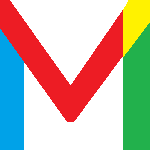

### Site réalisé à partir de zéro

Bonjour, voici mon **premier projet**. Je partage avec vous ce site avec le code **commenté en français**.

### La version 1.0

Cette version est la version de base que j'ai codé à partir de zéro, un site qui s'adapte **à toutes les tailles d'écran**. Mon objectif sera d'améliorer le code plus tard et de mettre à jour les informations et les versions du site.
 

### Voici le lien du site : 

 <a href="https://kevinozkaraca.github.io/Site-curriculum-vitae/" target="_blank">Cliquer ICI !</a>
   

### Vous pouvez également me suivre sur mes reseaux sociaux : 

    

            
            
             
            
            
            
            
            
    
  

